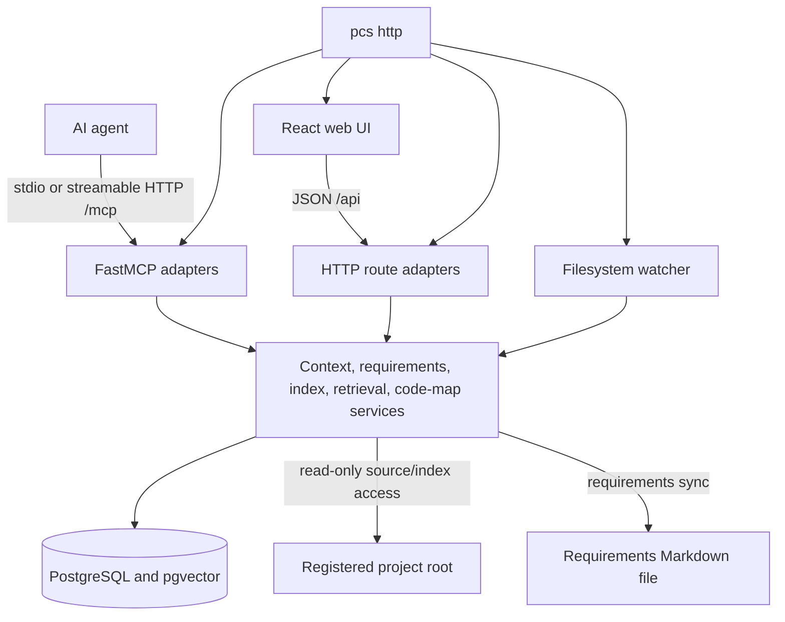

# Architecture

`pcs` gives AI agents and people one shared project context store, a searchable code index, and a code-map web UI. The Python process exposes the same application logic through MCP and JSON HTTP routes (AC14).

## Runtime components

- `pcs stdio` runs the FastMCP server without a listen socket (FR42).
- `pcs http` serves streamable HTTP MCP at `/mcp`, custom `/api` routes, and—when `PCS_STATIC_DIR` points to a build—the React SPA (NFR3, NFR13).
- MCP and HTTP adapters delegate to the same service modules and database, so writes made in the UI are visible to MCP clients and conversely (AC14).

Sources: `server/src/pcs/__main__.py`, `server/src/pcs/mcp/server.py`, `server/src/pcs/web_api/`, `server/src/pcs/web_static.py`.

## Curated context

Each registered project has `overview`, `focus`, `blockers`, `bugs`, `conventions`, `decisions`, `requirements`, and `glossary` sections. Entries have immutable revision history and lifecycle states. Briefings rank and compact active entries to a configured token budget; resource and entry reads retain verbatim detail.

The `requirements` section can synchronize with a Markdown file. Registration creates the configured template when absent. Store writes are written through to the file; explicit sync performs a three-way reconciliation. Deleted file blocks are archived rather than resurrected, and store status wins a simultaneous status conflict.

T13 compliance reads compose the T10 contract and T12 evidence services without executing tests, parsing logs, or applying LLM judgement. HTTP and MCP adapters return the same deterministic service payload. Requirement implementation `status` remains separate from the `verified`, `failed`, or `not-configured` compliance verdict. Multi-requirement responses are bounded and expose omission counts.

Sources: `server/src/pcs/context/`, `server/src/pcs/requirements/`, `server/src/pcs/web_api/requirements_routes.py`, `server/src/pcs/mcp/compliance_tools.py`.

## Code intelligence

Registration indexes a project immediately when its root exists. The indexer:

1. Walks the project while applying default exclusions, `.gitignore`, `PCS_INDEX_IGNORE`, `PCS_INDEX_ALLOW`, and the size limit.
2. Chunks supported source with tree-sitter and falls back to text chunks.
3. Extracts symbols and dependency edges through configured SCIP indexers or fallback tags.
4. Stores files, chunks, symbols, edges, status, and optional embeddings in PostgreSQL's rebuildable `code_index` schema.
5. Supports incremental refresh and, in HTTP mode, filesystem watches for registered roots.

Keyword and structural search always work. Semantic ranking is disabled unless `PCS_EMBEDDING_BACKEND` is configured. `retrieve_context` returns a token-bounded code/doc pack; `prepare_task` combines that pack with the curated briefing. The code map is a stateless, level-of-detail projection over the live index, not a separately stored graph.

Sources: `server/src/pcs/index/`, `server/src/pcs/codemap/service.py`, `server/src/pcs/mcp/server.py`.

## Persistence and failure boundaries

- PostgreSQL stores curated context and the code index. Curated tables survive rebuilding or dropping `code_index` (NFR12).
- The Compose `pcs_pgdata` volume persists PostgreSQL. `pcs_index` is reserved for on-disk artifacts; current searchable index records live in PostgreSQL.
- Source retrieval reads only a non-skipped indexed path, rejects absolute/traversal paths, and caps responses at 512 KiB.
- Project code is read but never executed. Optional SCIP binaries are indexers supplied by the operator.
- With no summary provider, long entries use deterministic truncation. With no embedding provider, search is keyword/structural only.

## Network and data boundaries

Local Docker deployment publishes HTTP and PostgreSQL only on host loopback. The HTTP process binds `0.0.0.0` inside the container so Docker can route the loopback-only publish. The Tailscale overlay removes the HTTP host publish and binds the server to a validated CGNAT tailnet IPv4; Funnel is not enabled.

Code or context is sent to a third-party inference endpoint only when an operator configures an OpenAI-compatible embedding or summarization backend. MCP, HTTP, browser, and Tailscale clients can also receive requested project data. Provider requests use `PCS_EMBEDDING_BASE_URL` or `PCS_SUMMARY_BASE_URL` with their respective API key. See [Configuration](configuration.md) and [Deployment](deploy.md).
