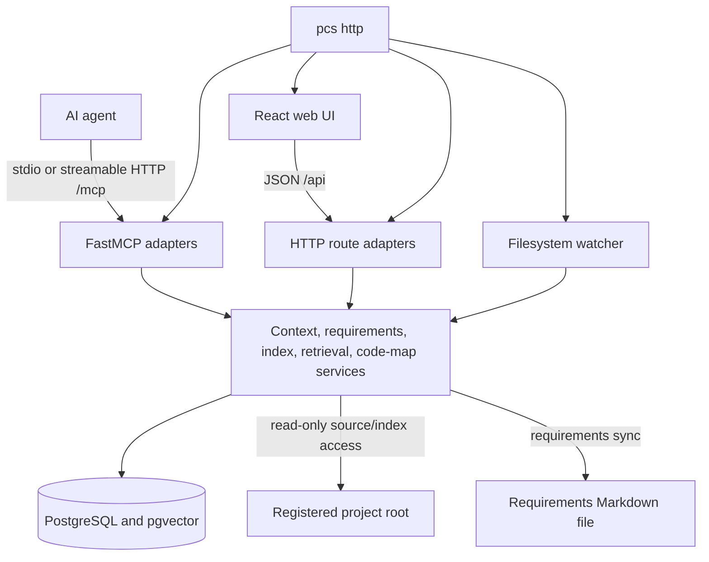
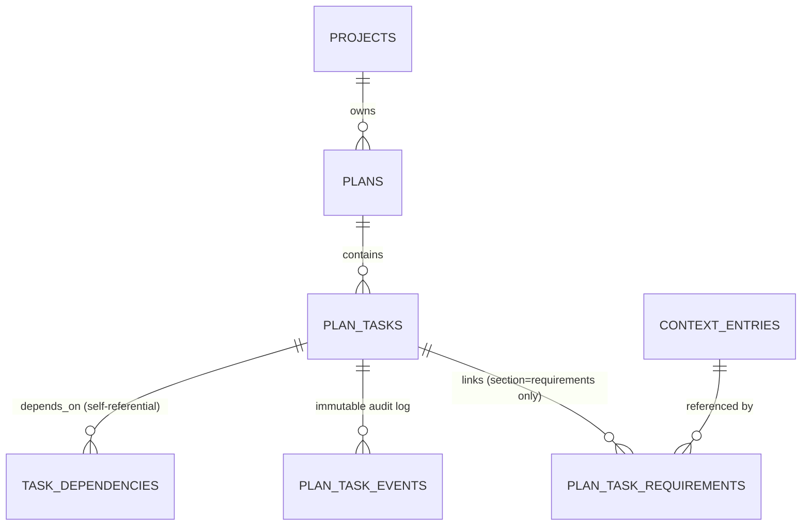

# Architecture

`pcs` gives AI agents and people one shared project context store, a searchable code index, and a code-map web UI. The Python process exposes the same application logic through MCP and JSON HTTP routes (AC14).

## Runtime components



- `pcs stdio` runs the FastMCP server without a listen socket (FR42).
- `pcs http` serves streamable HTTP MCP at `/mcp`, custom `/api` routes, and—when `PCS_STATIC_DIR` points to a build—the React SPA (NFR3, NFR13).
- MCP and HTTP adapters delegate to the same service modules and database, so writes made in the UI are visible to MCP clients and conversely (AC14).

Sources: `server/src/pcs/__main__.py`, `server/src/pcs/mcp/server.py`, `server/src/pcs/web_api/`, `server/src/pcs/web_static.py`.

## Curated context

Each registered project has `overview`, `focus`, `blockers`, `bugs`, `conventions`, `decisions`, `requirements`, and `glossary` sections. Entries have immutable revision history and lifecycle states. Briefings rank and compact active entries to a configured token budget; resource and entry reads retain verbatim detail.

The `requirements` section can synchronize with a Markdown file. Registration creates the configured template when absent. Store writes are written through to the file; explicit sync performs a three-way reconciliation. Deleted file blocks are archived rather than resurrected, and store status wins a simultaneous status conflict.

T13 compliance reads compose the T10 contract and T12 evidence services without executing tests, parsing logs, or applying LLM judgement. HTTP and MCP adapters return the same deterministic service payload. Requirement implementation `status` remains separate from the `verified`, `failed`, or `not-configured` compliance verdict. Multi-requirement responses are bounded and expose omission counts.

T14 authoring adapters expose MCP tools and equivalent HTTP `POST`/`PATCH`/`DELETE` routes that call `pcs.requirements.contracts` create/update/soft-delete functions. Adapters record the MCP or `X-PCS-Caller` identity, reject empty merge-updates, reject HTTP unknown fields and coerced JSON types, and treat explicit JSON `null` on a patch field as a whole-payload error (omitted keys stay). Contract HTTP GET and MCP contract reads/mutations in this module log outcome categories only (`ok`, `error: validation`, `error: not-found`, `error: project-not-found`, `error: failed`) and never include contract prose, keys, enum values, or caller payload. Soft-delete keeps immutable revisions; deleting an invariant cascades open criteria.

Sources: `server/src/pcs/context/`, `server/src/pcs/requirements/`, `server/src/pcs/web_api/requirements_routes.py`, `server/src/pcs/mcp/compliance_tools.py`, `server/src/pcs/mcp/contract_tools.py`.

## Code intelligence

Registration indexes a project immediately when its root exists. The indexer:

1. Walks the project while applying default exclusions, `.gitignore`, `PCS_INDEX_IGNORE`, `PCS_INDEX_ALLOW`, and the size limit.
2. Chunks supported source with tree-sitter and falls back to text chunks.
3. Extracts symbols and dependency edges through configured SCIP indexers or fallback tags.
4. Stores files, chunks, symbols, edges, status, and optional embeddings in PostgreSQL's rebuildable `code_index` schema.
5. Supports incremental refresh and, in HTTP mode, filesystem watches for registered roots.

Keyword and structural search always work. Semantic ranking is disabled unless `PCS_EMBEDDING_BACKEND` is configured. `retrieve_context` returns a token-bounded code/doc pack; `prepare_task` combines that pack with the curated briefing. The code map is a stateless, level-of-detail projection over the live index, not a separately stored graph.

Sources: `server/src/pcs/index/`, `server/src/pcs/codemap/service.py`, `server/src/pcs/mcp/server.py`.

## Plan & task orchestration

Multi-agent and human work is organized as plans containing a task DAG, atomic claim leases, and an immutable event history (FR43-FR48, D18-D24, Phase 4 / T22-T29). MCP and HTTP adapters (`pcs.mcp.planning_tools`, `pcs.web_api.planning_routes`) are thin, audited wrappers over one service module (`pcs.planning.service`) — no business logic is duplicated between transports (AC14).



**Composite foreign-key isolation (INV-PLAN-1).** `plan_tasks` carries a `UNIQUE (id, plan_id, project_id)` constraint. `task_dependencies` stores `project_id` and `plan_id` on the edge itself and references `plan_tasks(id, plan_id, project_id)` on *both* `task_id` and `depends_on_task_id` — so the database, not just the service layer, physically rejects a dependency that reaches into another plan or another project. `plan_task_events` carries the same composite FK on `task_id`. `plan_task_requirements` additionally constrains `requirement_section` to the literal `'requirements'` via a `CheckConstraint` plus a composite FK into `context_entries(id, section)`, so a task can only ever link to an actual requirement entry, never a blocker/bug/decision/etc.

**Lease lifecycle (INV-PLAN-3, D20).** A lease is active while `lease_expires_at > now()`; at or below `now()` it is expired and safely reclaimable — the exact boundary `lease_expires_at == now()` counts as expired everywhere (`list_ready_tasks` and `claim_task` agree). `claim_task` stores only a token *hash*; the raw one-time `claim_token` is returned exactly once, in the claim response, and never again. Every mutation on a task holding an active lease strictly requires that current token — there is no operator bypass — except `archive_plan`, formalized as the sole trusted administrative exception: it atomically revokes every active lease in the plan and cancels non-terminal tasks in one transaction.

```mermaid
sequenceDiagram
    participant A as Agent A
    participant S as pcs.planning.service
    participant B as Agent B
    A->>S: claim_task(lease=1800s)
    S-->>A: {task, claim_token} (returned once)
    A->>S: heartbeat_task(claim_token)
    S-->>A: lease extended, status unchanged
    B->>S: claim_task() while lease active
    S-->>B: 409 ClaimConflictError
    Note over S: lease_expires_at <= now()
    B->>S: claim_task() — reclaim
    S-->>B: {task, new claim_token}; A's old token now stale
    A->>S: complete_task(old claim_token)
    S-->>A: 409 StaleClaimTokenError
```

**DAG resolution (FR45, FR46).** Dependencies are validated acyclic at write time (Kahn's algorithm; self-dependencies and cycles are rejected before any row is written). `activate_plan` moves every zero-dependency task to `ready`. `list_ready_tasks`' canonical predicate: the owning plan is `active`; the task's own status is not `completed`/`cancelled`/`blocked`; every prerequisite in the DAG is `completed`; and the task's status is `ready`, or it holds an expired/reclaimable lease. `complete_task` re-evaluates each direct dependent so downstream tasks unlock the moment their last prerequisite finishes, without a separate scheduler.

**AI draft approval (INV-PLAN-6, T26/T28).** `generate_plan_draft` is strictly read-only: it gathers bounded project context (briefing, open requirements, codebase-guide facts — all explicitly labeled untrusted in the prompt), calls the project's persisted T20 summary provider over the same DNS-pinned, redirect-disabled endpoint the summarizer uses, and validates the response against a strict schema (`pcs.planning.schemas`) before returning it — unknown fields, dependency cycles, dangling references, and hallucinated requirement ids are all rejected. It never calls `session.add`/`session.execute` against any planning table. A row is written only when the caller separately calls `create_plan_with_tasks` (T23) — the same atomic, all-or-nothing creation path a manually authored plan uses — with data of their own choosing; there is no implicit or partial persistence path between generation and approval.

**Requirement independence (D4, INV-PLAN-2).** Task and plan completion never write to `context_entries` or its `requirement_status` field. A task's `requirement_ids` are informational links for `prepare_task`/handoff context only; the close-gate and compliance machinery (T10-T13) remains the sole path to `done`.

Sources: `server/src/pcs/planning/`, `server/src/pcs/mcp/planning_tools.py`, `server/src/pcs/web_api/planning_routes.py`, `server/src/pcs/alembic/versions/0023_plan_task_orchestration.py`, `server/src/pcs/alembic/versions/0024_merge_ai_settings_plan_task_heads.py`.

## Persistence and failure boundaries

- PostgreSQL stores curated context and the code index. Curated tables survive rebuilding or dropping `code_index` (NFR12).
- The Compose `pcs_pgdata` volume persists PostgreSQL. `pcs_index` is reserved for on-disk artifacts; current searchable index records live in PostgreSQL.
- Source retrieval reads only a non-skipped indexed path, rejects absolute/traversal paths, and caps responses at 512 KiB.
- Project code is read but never executed. Optional SCIP binaries are indexers supplied by the operator.
- With no summary provider, long entries use deterministic truncation. With no embedding provider, search is keyword/structural only.

## Network and data boundaries

Local Docker deployment publishes HTTP and PostgreSQL only on host loopback. The HTTP process binds `0.0.0.0` inside the container so Docker can route the loopback-only publish. The Tailscale overlay removes the HTTP host publish and binds the server to a validated CGNAT tailnet IPv4; Funnel is not enabled.

Code or context is sent to a third-party inference endpoint only when an operator configures an OpenAI-compatible embedding or summarization backend. MCP, HTTP, browser, and Tailscale clients can also receive requested project data. Provider requests use `PCS_EMBEDDING_BASE_URL` or `PCS_SUMMARY_BASE_URL` with their respective API key. See [Configuration](configuration.md) and [Deployment](deploy.md).
